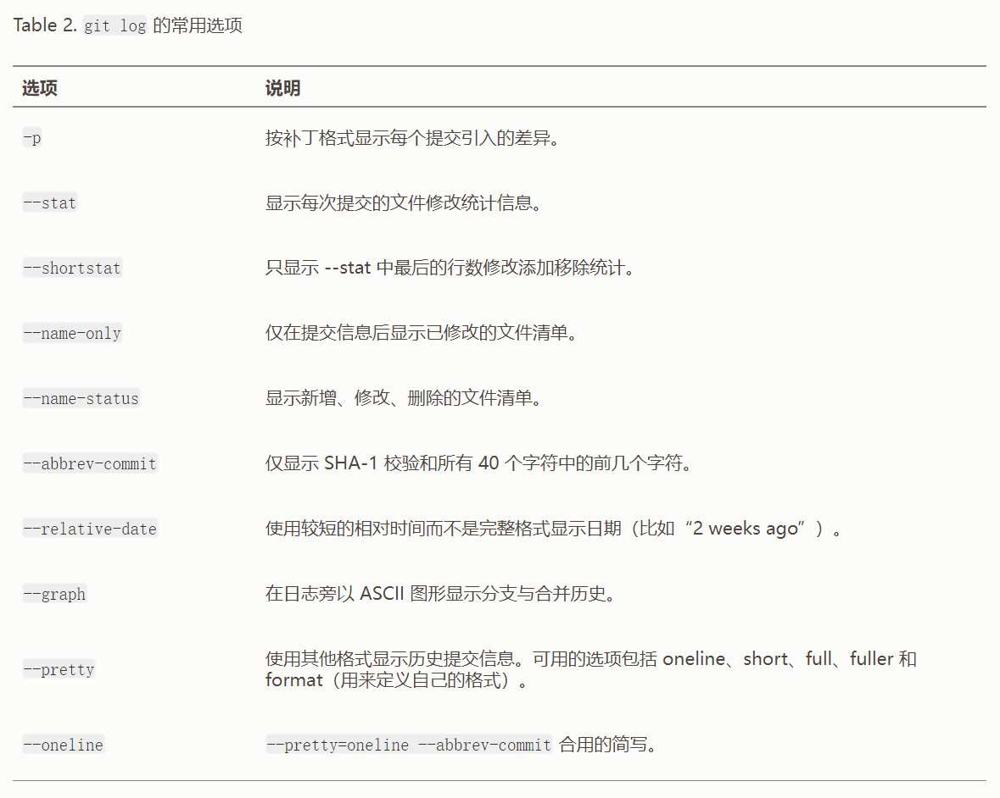
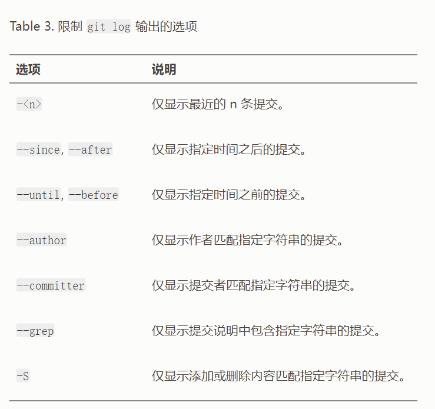

# Git 使用手册

## 获取Git 仓库

```shell
1. git init
2. git clone <url>
```

##  记录每次更新到仓库


```shell
1. 检查当前文件状态
	git status
2. 跟踪新文件
	git add
3. 暂存已修改的文件
	git add
4. 状态简览
	git status -s
5. 忽略文件
	.gitignore
6. 查看已暂存和未暂存的修改
	git diff
7. 提交更新
	git commit
8. 跳过使用暂存区域
	git commit -a
9. 移除文件
	git rm
10. 移动文件
	git mv file_from file_to
```


## 查看提交历史

```shell
git log  按时间先后顺序列出所有的提交
git log -p -2/  git log -patch -2  显示每次提交所引入的差异
git log --stat  每次提交的简略统计信息
```





## 撤销操作

```shell
git commit --amend
git reset HEAD <file> 取消暂存的文件
git checkout -- <file> 撤消对文件的修改
```

## 远程仓库的使用

```shell
git remote add https://github.com/USERNAME/REPOSITORY.git
git remote add git@github.com:USERNAME/REPOSITORY.git

提交到github
…or create a new repository on the command line
echo "# -------" >> README.md
git init
git add README.md
git commit -m "first commit"
git branch -M main
git remote add origin git@github.com:lwj-zxd/-------.git
git push -u origin main
…or push an existing repository from the command line
git remote add origin git@github.com:lwj-zxd/-------.git
git branch -M main
git push -u origin main
```

## 打标签

## Git 别名

## 总结

